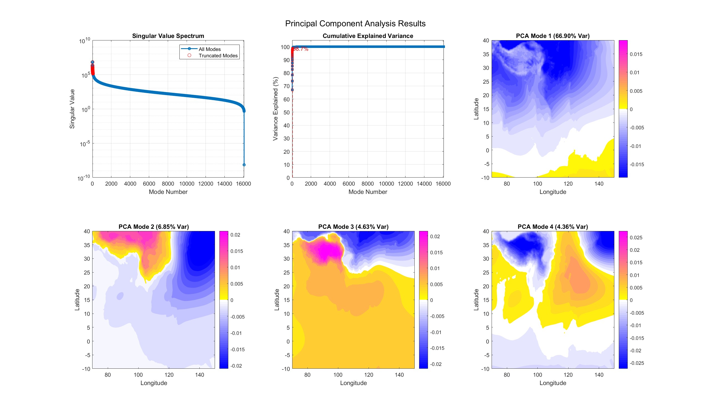
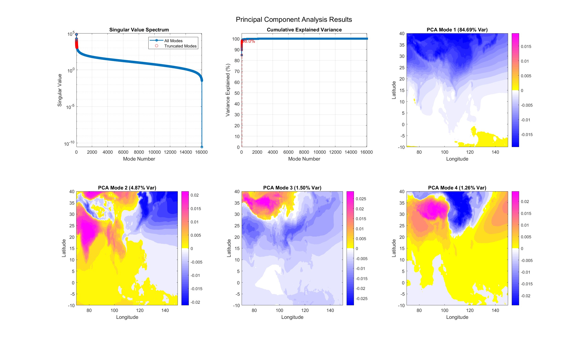
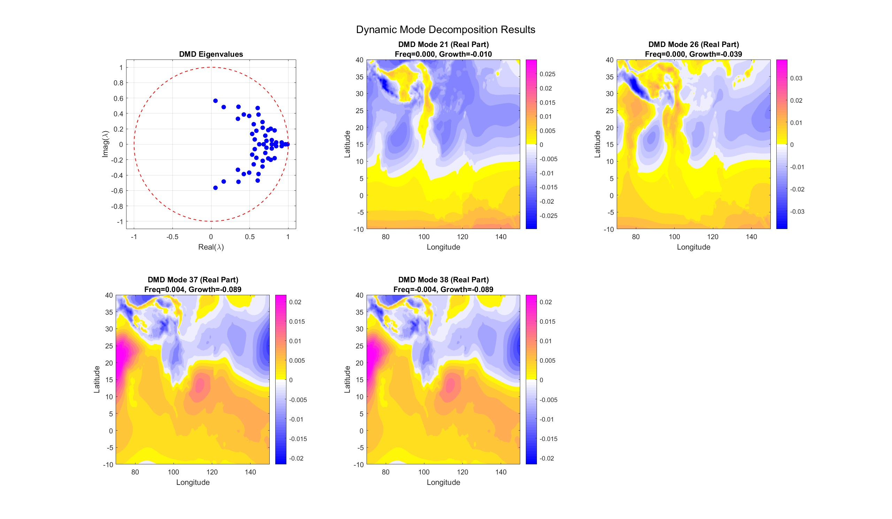
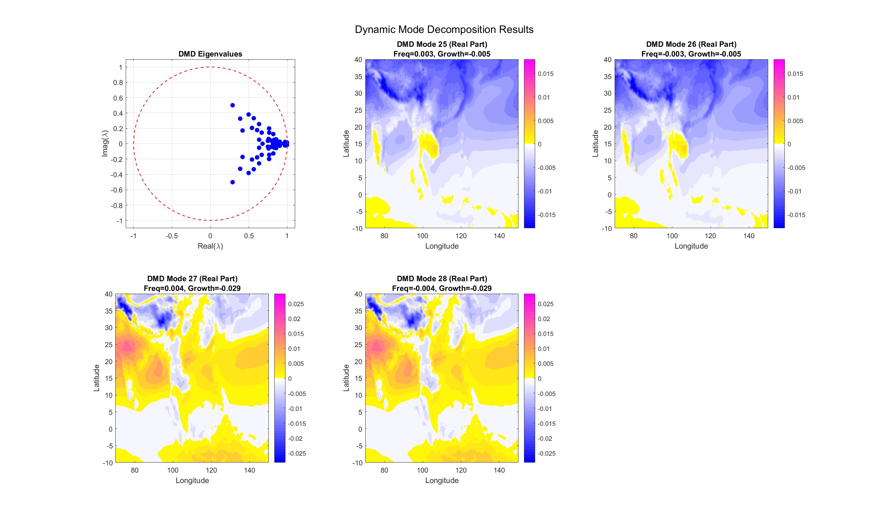
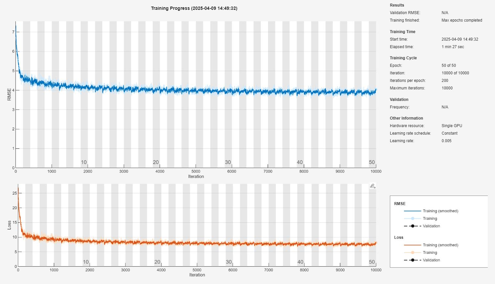
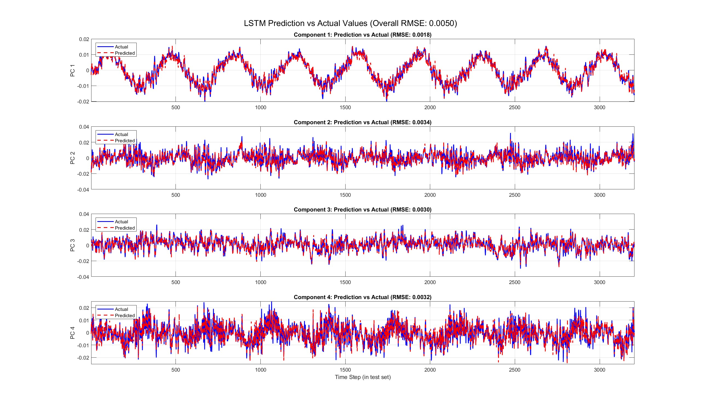
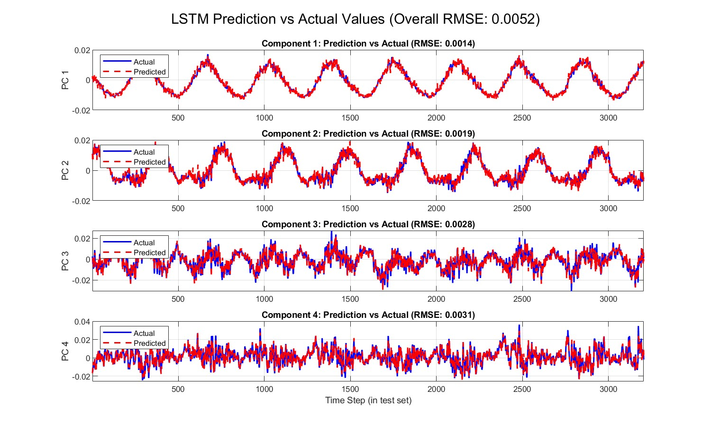

# 🌏 Data-Driven Analysis of Indo-Pacific Climate System Dynamics

## Project Overview

This project aims to explore the **dynamical characteristics** of the **Indo-Pacific climate system** using **data-driven methods**. We utilize high-resolution daily-averaged reanalysis datasets (1979–2022) that include:

- **Sea Level Pressure (SLP)**
- **2-Meter Air Temperature (T2M)**

### Methodology Summary

1. **Principal Component Analysis (PCA)**  
   Applied to both high-dimensional spatiotemporal datasets to extract dominant spatial modes and their temporal evolution.

2. **Dynamic Mode Decomposition (DMD)**  
   Performed on the low-dimensional representations from PCA to identify dominant dynamic patterns with specific frequencies and growth/decay rates.

3. **Long Short-Term Memory Networks (LSTM)**  
   Used to model the temporal dependencies within the PCA time series and assess the predictability of the system.

By integrating **PCA, DMD, and LSTM**, the project aims to uncover key variability patterns, dynamical behaviors, and the predictability of:

- **Atmospheric circulation (represented by SLP)**
- **Surface temperature (represented by T2M)**

in this critical climate region.

---

## 📁 Directory Structure

```plaintext
project_root/
│
├── data/       # Contains raw SLP and T2M datasets and intermediate workspace data
│
├── output/     # Stores results, visualizations, and command logs
│
└── utils/      # Includes all required function scripts used in main analysis
```

---

## ⚙️ How to Use

### Configuration

All runtime configurations are set in the file: `main_analysis.m`

### Data Options

#### ✅ Using Pre-Saved Data

1. Open `main_analysis.m`
2. **Uncomment lines 8 and 9** to load the saved workspace data
3. After completing the first section, directly run the following parts to display results:
   - `3. Plot PCA Results`
   - `5. Plot Dynamic Analysis Results`
   - `11. Evaluate and Visualize Predictions`

#### ❌ Starting from Raw Data

1. In `main_analysis.m`, enable lines 13 and 14 according to the comments
2. Execute all sections in `main_analysis.m` sequentially
3. ⚠️ **Note: PCA processing is computationally intensive**

---

## 🔁 Workflow Overview

1. **Data Loading & Preprocessing**
   - Load variables (SLP or T2M) from NetCDF files
   - Reshape data into a 2D matrix: spatial points × time
   - Remove the temporal mean to extract anomalies

2. **PCA Dimensionality Reduction**
   - Perform PCA via SVD (`svds` for efficiency)
   - Decompose into spatial modes (Ur), singular values (Sr), and temporal coefficients (Vr)
   - Truncate to desired rank `r`

3. **PCA Visualization**
   - Plot singular value spectrum
   - Cumulative variance explained
   - Spatial modes visualization

4. **Dynamic Analysis (DMD or HAVOK)**
   - Apply selected `analysis_method` to PCA time series (Vr)
   - Extract dynamic features such as eigenvalues, growth rates, and spatial patterns

5. **Dynamic Analysis Visualization**
   - DMD: Show eigenvalue spectrum and mode patterns
   - HAVOK: Show system eigenvalues and state evolution

6. **LSTM Data Preparation**
   - Split Vr into training and testing sets (default 80%/20%)
   - Normalize data
   - Construct sliding window sequences for `XTrain`, `XTest`, and corresponding targets `YTrain`, `YTest`

7. **LSTM Network Design**
   - Define a network with sequence input, LSTM, fully connected, and regression layers

8. **Training Configuration**
   - Set optimizer, learning rate, epochs, mini-batch size, etc.

9. **LSTM Training**
   - Format `YTrain` as a matrix
   - Use `trainNetwork()` with `XTrain`, `YTrain_matrix`, `layers`, and `options`

10. **LSTM Prediction**
    - Use the trained network to predict on `XTest`
    - Obtain normalized predictions `YPred_normalized`

11. **Evaluation & Visualization**
    - Denormalize predictions
    - Compute RMSE
    - Plot predicted vs actual time series
---    

## 📊 Results & Visualizations

Below are selected examples of the analysis outputs:

### 1. PCA Results

**a. Sea Level Pressure (SLP)**
  


**b. Two-meter Temperature (T2M)**



### 2. Dynamic Mode Decomposition (DMD)

**a. DMD Eigenvalue Spectrum**

**a. Sea Level Pressure (SLP)**
  


**b. Two-meter Temperature (T2M)**



### 3. LSTM Training and Prediction

**a. Sea Level Pressure (SLP) - Training**
  


**b. Two-meter Temperature (T2M) - Training**


**c. Sea Level Pressure (SLP) - Testing**
  


**d. Two-meter Temperature (T2M) - Testing**



---

## 📌 Conclusion

Through a combined application of PCA, DMD, and LSTM, this project:

- Reduces dimensionality while preserving key variability features
- Extracts dominant dynamical patterns from the atmosphere and surface temperature
- Models and predicts temporal evolution with deep learning

The results demonstrate promising capabilities for understanding and forecasting Indo-Pacific climate dynamics.